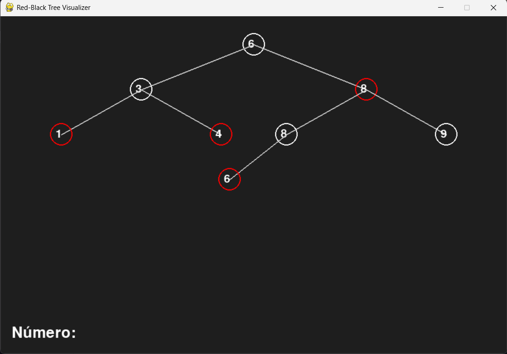

# Red Black Visualizer

## Alunos  
| Matrícula | Nome                                      |  
|-----------|-------------------------------------------|  
| 21/1031083 | Julia Vitória Freire Silva                |  
| 20/0038028 | Guilherme Evangelista Ferreira dos Santos |  

---

## Descrição do projeto  
Este projeto implementa uma **visualização interativa** para demonstrar o funcionamento de uma **Árvore Red-Black**.

A aplicação, desenvolvida em **Python**, permite:  
- Mostrar passo a passo o processo de inserção e remoção de nós na árvore.  
- Destacar as alterações nas propriedades da árvore (cor dos nós e balanceamento).  
- Exibir as rotações realizadas para manter as propriedades da árvore Red-Black.
- Permitir interação do usuário (passo a passo ou execução automática).  
- Colorir dinamicamente os elementos para indicar o estado atual da árvore.

---

## Guia de instalação  

### Dependências do projeto  
- **Python 3.8+**  

Para instalar as dependências, execute:  
```bash
pip install -r requirements.txt
````

### Como executar o projeto

1. Clone o repositório:

```bash
git clone https://github.com/SeuUsuario/RedBlackVisualizer.git
```

2. Execute o arquivo principal:

```bash
python red_black_visualizer.py
```

3. Controles disponíveis:

* **S** → Executa um passo da inserção de um nó na árvore.
* **R** → Executa um passo da remoção de um nó da árvore.
* **ESPAÇO** → Inicia/pausa a execução automática do processo.
* **C** → Cria uma nova árvore com um conjunto de valores aleatórios.

---

## Capturas de tela



---

## 🎥 Vídeo de Apresentação

Neste vídeo, apresentamos um resumo completo do trabalho desenvolvido, abordando os principais pontos discutidos ao longo do projeto.

[Assista no YouTube](https://youtu.be/3Bvmv71fBWk)

---

## Conclusões

* A **Árvore Red-Black** é uma estrutura de dados eficiente para busca, inserção e remoção de elementos, com complexidade O(log n) para essas operações.
* O uso das propriedades de balanceamento (cores dos nós e rotações) garante que a árvore permaneça balanceada, evitando degradação de desempenho.
* A visualização gráfica facilita o **entendimento didático** do funcionamento da árvore e das operações realizadas.
* **Limitação**: a visualização é limitada à inserção e remoção de nós e não inclui outras operações como busca e travessia da árvore.

---


